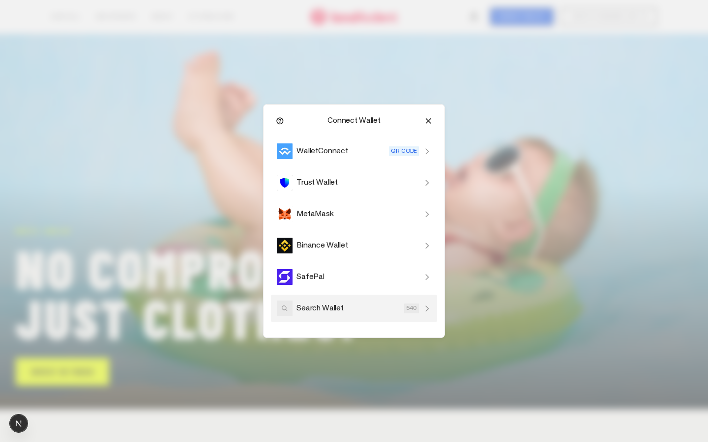
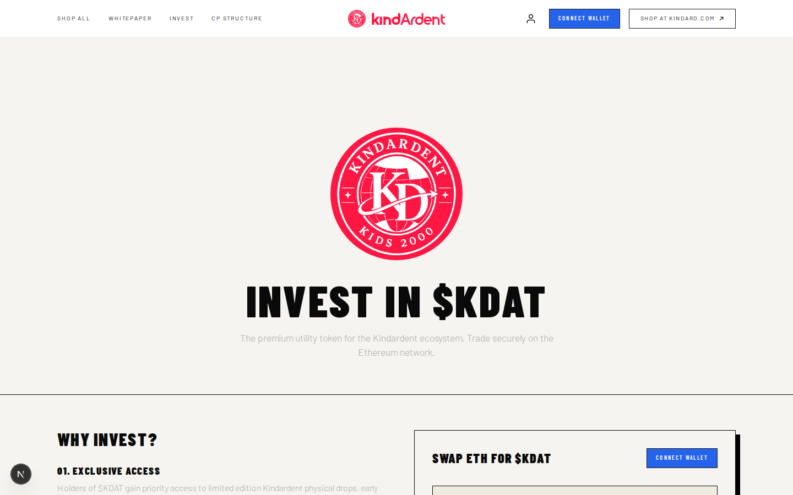
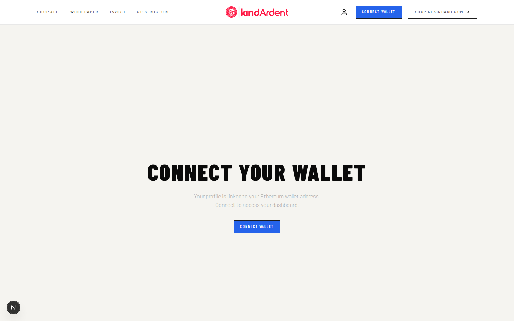
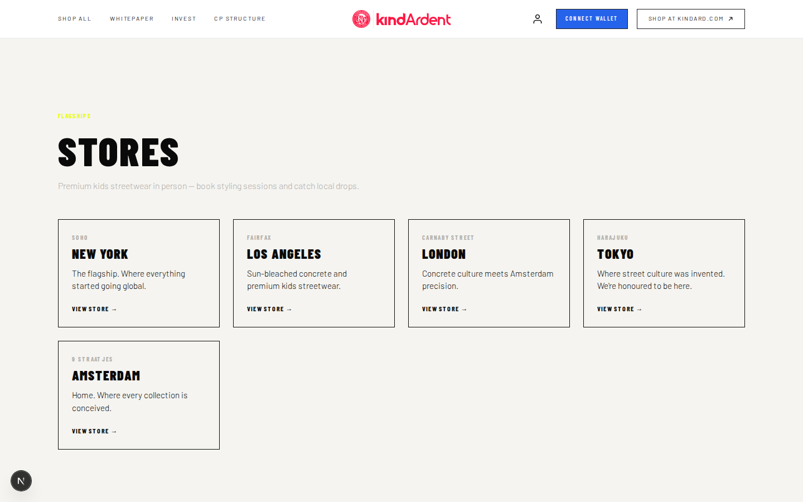

# Kindardent

Premium kids streetwear meets Web3 — Next.js storefront for Kindard Kids and the `$KDAT` token.

**Repo:** https://github.com/Kindard-com/Kindardent

---

## Demo (tested locally)

Screenshots and a short walkthrough captured against `npm run dev` on Aug 14, 2026.

### Homepage


### Connect Wallet (Reown AppKit / Wagmi SDK)


### Buy / Invest ($KDAT)


### Profile (wallet gate)


### Stores


### Walkthrough video
[Watch the demo video](docs/demo/kindardent-demo.mp4)

---

## Tech stack

- **Framework:** Next.js 16 (App Router)
- **Styling:** Custom CSS + Tailwind 4
- **Web3 SDK:** [Wagmi](https://wagmi.sh/) + [Reown AppKit](https://reown.com/appkit)
- **Database:** [Turso](https://turso.tech/) (libSQL) for wallet-linked profiles
- **CMS:** Payload 3 (optional admin)

---

## Install & run

### Prerequisites
- Node.js 18+
- npm

### Clone
```bash
git clone https://github.com/Kindard-com/Kindardent.git
cd Kindardent
```

### Configure environment
```bash
cp .env.example .env.local
```

Set at least:

| Variable | Purpose |
|---|---|
| `TURSO_DATABASE_URL` | Turso libSQL URL |
| `TURSO_AUTH_TOKEN` | Turso auth token |
| `NEXT_PUBLIC_REOWN_PROJECT_ID` | Reown Cloud project ID (optional; a default is embedded for demos) |
| `PAYLOAD_SECRET` | Payload CMS secret |
| `ADMIN_EMAIL` / `ADMIN_PASSWORD` | Only for local admin seed |

Never commit `.env.local` or real secrets.

### Install & start
```bash
npm install
npm run dev
```

Open [http://localhost:3000](http://localhost:3000).

### SDK smoke test (optional)
With the dev server running:
```bash
npx playwright install chromium
node scripts/test-wallet.mjs
```
This clicks **Connect Wallet**, asserts the AppKit modal mounts, and refreshes screenshots under `docs/demo/`.

---

## Key routes

| Path | Description |
|---|---|
| `/` | Commerce hero + new arrivals |
| `/buy` | `$KDAT` swap UI + wallet connect |
| `/profile` | Wallet-gated profile (Turso) |
| `/whitepaper` | Tokenomics |
| `/stores` | Flagship store index |
| `/stores/[city]` | Per-city store page |

---

## Test notes (this branch)

- Homepage, buy, profile, whitepaper, about, stores: **200 OK**
- Reown AppKit modal opens via `useAppKit().open()` (MetaMask, WalletConnect, Trust, etc.)
- Profile API `/api/profile` responds when Turso env is set
- Secrets removed from source (`lib/turso.ts`, seed routes); use `.env.local`
- `/stores` index page restored (was 404)

---

## Smart contracts

`$KDAT` swap UI is prototype mode. Wallet connect and native ETH balance reads work; on-chain swap needs the final contract address.
